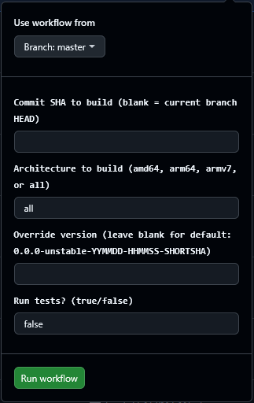

# PiGallery2 Docker Contribution guide (draft)

Remember to update all the Dockerfiles.

## Linting
To quality check your dockerfile changes you can use hadolint:

1. Start the docker daemon if it's not already started: `sudo dockerd`
2. Change dir to the docker folder.
3. Run hadolint on the alpine dockerfile: `docker run --rm -i -v ./.config/hadolint.yml:/.config/hadolint.yaml hadolint/hadolint < ./alpine/Dockerfile.build`
4. Run hadolint on the debian-trixie dockerfile: `docker run --rm -i -v ./.config/hadolint.yml:/.config/hadolint.yaml hadolint/hadolint < ./debian-trixie/Dockerfile.build`
7. Run hadolint on the debian-trixie selfcontained dockerfile: `docker run --rm -i -v ./.config/hadolint.yml:/.config/hadolint.yaml hadolint/hadolint < ./debian-trixie/selfcontained/Dockerfile`
8. Fix errors and warnings or add them to ignore list of the [hadolint configuration file](./.config/hadolint.yml) if there is a good reason for that. Read more [here](https://github.com/hadolint/hadolint).

### Building the docker image locally

Instructions below are incomplete, but might get you started.
```
$ git clone https://github.com/bpatrik/pigallery2.git
$ cd pigallery2/
$ npm install
$ npm run create-release
$ mkdir pigallery2-release
$ cp pigallery2.zip pigallery2-release/
$ cd pigallery2-release/
$ unzip pigallery2.zip
$ rm pigallery2.zip
$ docker buildx build \
  --platform linux/amd64 \
  -t pigallery2_test \
  -f ./docker/alpine/Dockerfile.build \
  . \
  --output=type=docker,dest=pigallery2-test
```

### Building a docker image from a specific commit ID

When you fork this repo, you can build an image using the `build-from-commit_id-between-v2-and-v3` github actions workflow.

> This github actions workflow was created in order to retrospectively create builds and releases of commits between versions 2.0.0 and 3.0.0, which was the period between October 2023 and late June 2025. The workflow will not work on commits in July 2025 and onwards, which was where `arm/v7` support was dropped. Any release made with the workflow, should still support `arm/v7`, e.g. Raspberry Pi 2 and 3, which was the primary reason to create the workflow.

#### Preconditions

It requires that you set these github secrets for your fork (info from your docker-hub account):
- `REGISTRY_NAMESPACE`
- `REGISTRY_USERNAME`
- `REGISTRY_PASSWORD`

#### Usage

When you run the workflow / github action, it will ask you for a commit ID which will then be built and published to docker hub, given the 3 values above.


